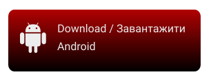
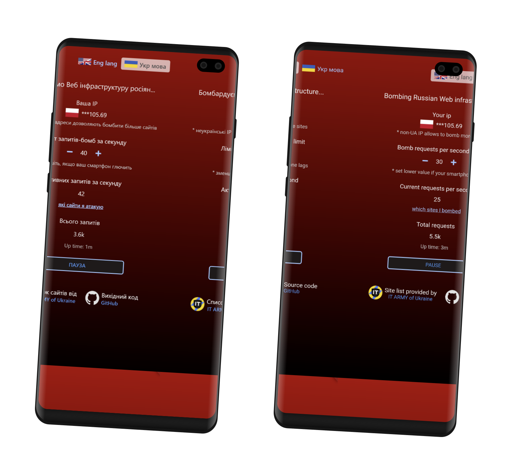

# Атакуємо WEB сайти рашистів зі смартфону

Завантажте APK файл на свій смартфон і встановіть його:

[](https://github.com/redblackfury/AttackRussianWebMob/releases/download/v8.0/attack_ru_web_v8.0.apk)

Хочете запустити на компьютері? Вам сюди: [AttackRussianWeb for Windows/Linux/Mac](https://github.com/redblackfury/AttackRussianWeb)


# Переконатися що це не вірус

За посиланням ви можете побачити результати перевірки файлу від VirusTotal ([що це таке?](https://uk.wikipedia.org/wiki/Virustotal))


[](https://www.virustotal.com/gui/file/eead6cbe5951a01405a4c795726d002ea9f9944345833d434d9126457a115f1f)


Також, ви можете перевірити наш .apk файл перед встановленням власноруч використовуючи [форму перевірки VirusTotal](https://www.virustotal.com/gui/home/upload)

# Як виглядає застосунок / Preview



# Популярні питання

## Як допомогти проекту?

Максимально поширюйте застосунок і цю сторінку. Замовляйте рекламу якщо вмієте, публікуйте посилання на цю сторінку в соц. мережах. Кожне встановлення - це наш крок для перемоги. Пам'ятайте про це. Саме від того чи поширите ви цю сторінку своїм знайомим залежить сила нашої атаки. Кожний пристрій неймовірно важливий.


## Чи є в застосунку вбудований VPN або Proxy?

Ні, ми цілеспрямовано не додавали VPN тому що це би обмежило розмір мережі.

Проте застосунок відображає вашу поточну IP адресу (і відповідно країну до якої вона належить) і уже в залежності від неї розумно обирає цілі яким можна завдати найбільшої шкоди. Наприклад якщо ви запускаєте застосунок з України без VPN то сервер обере для вас ті цілі які зараз доступні для України (насправді навіть таких зазвичай багато). Проте враховуючи факт що багато сайтів агрессора активно блокують усі українські адреси, більшої шкоди можна завдати встановивши на телефон VPN який "телепортує" вас в іншу країну, відповідно всі запити будуть іти через неї. Можна обирати VPN з абсолютно будь-якої країни.

Застосунок сумісний з будь-якими VPN для Андроїд (можна шукати на Google Play або в Google). Після активації VPN можна одразу перезапустити застосунок і переконатися що країна в застосунку змінилася або просто зачекати до 10 хвилин після чого він сам визначить нову IP адресу (і країну) і перелаштує цілі.

## Як визначаються сайти по яким застосунок наносить удар і чи можна додати свій сайт?

Наші модератори які знаходяться в безпечному місці недоступному для фашистів власноруч отримують нові цілі з офіційного канала IT армії України https://t.me/itarmyofukraine2022 і встановлюють їх на сервері з якого застосунок обирає завдання. Додавати власні сайти для атаки на разі не можна оскільки ми маємо сконцентруватися на реально критичних веб-сервісах для інфраструктури окупанта.

## Де гарантія що я не атакую мирні сайти?

Застосунок містить функцію перегляду повного журналу атакованих сайтів і їх IP адрес, ви завжди можете переконатися що тільки сайти рекомендовані IT ARMY of Ukraine потрапляють під удар.

## “Батько подруги моєї сестри сказав що ДДоС атака шкодить нашому інтернету якому зараз і так погано” - чи правда це?
Ні, це повна маячня вигадана народними недоекспертами. Цей застосунок навантажує ваш канал інтернету не більше ніж завантаження файлу зі швидкістю до 100 КБ/С (200 HTTP запитів за секунду в середньому по пів кілобайту кожний).
Це ніяк не може нашкодити а ні нам а ні нашій мережі, інакше наш інтерент би було зруйновано при спробі подивитися фільм в онлайні однією людиною.
Будь ласка використовуйте інформацію з офіційних джерел, канал IT ARMY of Ukraine [створений міністром цифрової трансформації](https://uk.wikipedia.org/wiki/IT-%D0%B0%D1%80%D0%BC%D1%96%D1%8F_%D0%A3%D0%BA%D1%80%D0%B0%D1%97%D0%BD%D0%B8) не радив би долучатися до DDoS атак з VPN якби це могло зашкодити вам чи мережі


# Як зібрати застосунок власноруч

Встановіть Flutter SDK https://docs.flutter.dev/get-started/install

Потім склонуйте репозіторій і виконайте в консолі:

```
cd app
flutter build apk --release --no-sound-null-safety
```

Готово, скопіюйте APK файл на ваш телефон і встановіть.

# Чи можна забрати цей застосунок для iOS ?

В теорії так, читайте тут: https://docs.flutter.dev/deployment/ios

Ми не постачаємо версію для iOS тому що доля Android телефонів займає 81.7% ринку в Україні і 70.97% в світі і продовжує зростати.

