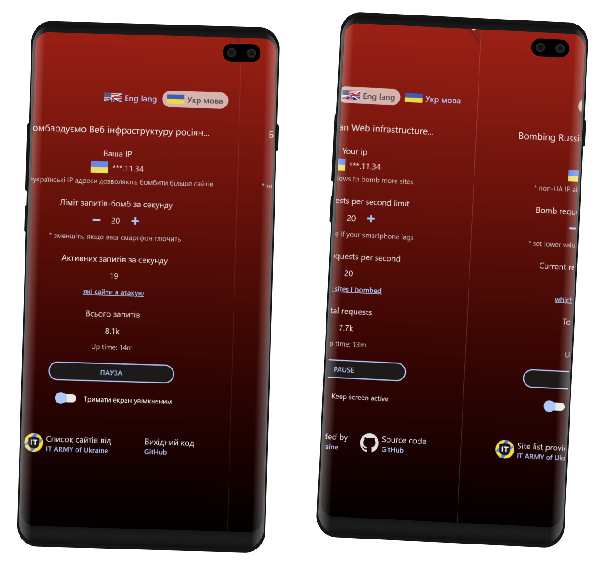

# Атакуємо WEB сайти рашистів зі смартфону

Завантажте APK файл на свій смартфон і встановіть його:

[](https://github.com/redblackfury/AttackRussianWebMob/releases/download/v2.0/attack_ru_web_v2.0.apk)


# Preview




# Build apk by yourself

Install https://docs.flutter.dev/get-started/install

Then run in console:

```
cd app
flutter build apk --release --no-sound-null-safety
```

Done, copy APK file to your phone and install it.

# Is it possible to build for iOS ?

In theory yes. Read here https://docs.flutter.dev/deployment/ios

Why we don't supply app for iOS? Because Android market share in Ukraine is 81.7% and it grows (70.97% worldwide).

